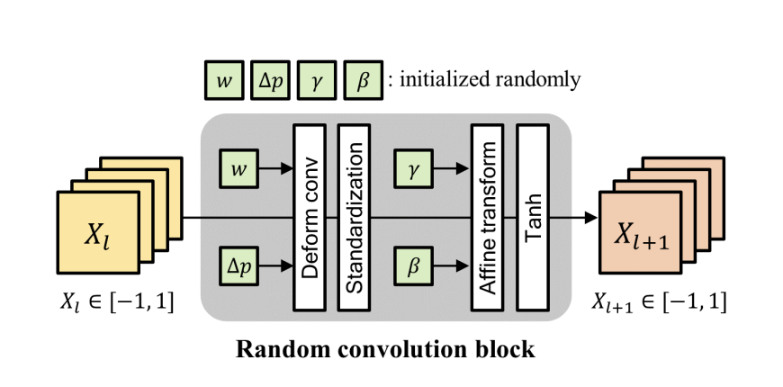

# Progressive Random Convolutions for Single Domain Generalization

> **Notice:** This repository is not the official implementation of the paper. While every effort has been made to reproduce the described method, there is no guarantee that the implementation will work exactly as intended or achieve the same results as the original work.

This readme file is an outcome of the CENG502 (Spring 2024) project for reproducing a paper without an implementation. See CENG502 (Spring 20224) Project List for a complete list of all paper reproduction projects. 
# 1. Introduction
__Single domain generalization (SDG) [1]__ in visual tasks aims to enable a model trained on a single source domain to perform well on unseen target domains. This can significantly reduce data collection and labeling costs and allow the model to be adapted to a wider range of applications. 

However, single domain generalization is a challenging problem. Different domains can exhibit significant variations in visual styles, illumination conditions, and object appearances. These variations can cause a model trained on a source domain to produce inconsistent results on the target domain.

This paper , __Progressive Random Convolutions for Single Domain Generalization [2] CVPR(2023)__, tries to solve this problem. They introduces a method called __Progressive Random Convolution (Pro-RandConv)__ to improve upon existing techniques like __RandConv [3]__, which suffer from limitations in maintaining semantic information as kernel sizes increase and lack diversity. Pro-RandConv robustifies the model's learning by using a series of randomly initialized convolution layers for each mini-batch. This allows the model to be less sensitive to different visual styles and appearances. 

This repository tries to reproduce their method based on their descriptions in the paper. The paper is available at [this link](https://arxiv.org/abs/2304.00424).

 
# 1.1 Paper Summary
Single domain generalization (SDG) aims to enable a model trained on a single source domain to perform effectively on unseen target domains. Image augmentation methods, such as __Random Convolutions (RandConv)__ [3], have been explored to address the challenges of SDG by introducing variations in the training data. However, these methods have limitations that hinder their performance.

Prior to the introduction of Pro-Random Convolutions (Pro-RandConv), RandConv was a prominent image augmentation method for SDG. However, RandConv exhibited certain shortcomings:

+ __Loss of Semantics with Increasing Kernel Size:__ RandConv's ability to capture complex spatial relationships was compromised as the random convolution kernel size increased, leading to a loss of semantic meaning in the generated images.

+ __Limited Diversity:__ Compared to a single, carefully designed convolution operation, RandConv offered less inherent diversity. This limitation restricted the model's ability to explore a broader range of potential image features and ultimately hinder its performance.

__Pro-Random Convolutions (Pro-RandConv)__ tackles the limitations of RandConv by introducing a sequence of randomly initialized convolution layers applied to each mini-batch of data. This progressive stacking of small kernel-sized convolutions allows the model to capture a wider range of image features while mitigating semantic distortions caused by larger kernels in RandConv. This approach ultimately enhances the model's robustness and generalizability in Single-Domain Generalization (SDG) tasks.

</figure>
    
    
Figure 1: Comparision with RandConv and Pro-RandConv. (from the paper)

</figure>

</figure>
    
    
Figure 2: Comparision with RandConv and Pro-RandConv. (from the paper)

</figure>

When we look Fig. 1(c), we can see the bad affect of increasing kernel size in RandConv's, instead of that if we use Pro-Random Convolutions and if we increase the repetitions we get better results. Also the image augmented by RandConv easily loses its semantics while increasing the kernel size, which is shown in Fig. 2(a). As a result, the ability to generalize in the test domain is greatly reduced as shown in Fig. 1(c).
# 2. The method and my interpretation

## 2.1. The original method

### 2.1.1. Training Objective
The authors assume that the training data comes from a single domain denoted as $ S = \{x_n, y_n\}_{n=1}^{N_s} $, where $ x_n $ is the n'th input image, $ y_n $ is the corresponding label and $ N_s $ is the number of samples in this domain. The goal is to train a model that generalizes well to unseen target domains. The model is trained to minimize the following objective function:

Equation 1: Training Objective

where $ f_\theta $ is the model, $ \theta $ is the model parameters, $ \mathcal{l} $ is the loss function. The model is trained using the training data from the source domain $ S $. This objective function is an Empirical Risk Minimization (ERM) problem.

### 2.1.2. Progressive Random Convolution (Pro-RandConv)

To improve diversity and generalization, the authors propose a proggresive approach for random convolutions. The method Progressive Random Convolution (Pro-RandConv) is based on the idea of stacking random convolution layers with small kernel sizes, as shown in Fig. 1(b). This approach has the following advantages:

- This approach inherently focuses on the center of the image, reducing the impact of irrelevant details and preventing meaning distortion.
- Stacking these filters with the same weights allows for more control over style variation compared to traditional methods

### 2.1.3. Random Convolution Block

The authors designed a random convolution block to replace the basic random convolution layer while preserving the progressive nature of the method. The random convolution block consists of a random convolution layer, a deformable offset layer, and an affine transformation layer. The block structure is shown in Fig 3.

<!-- This code block displays an image in the center of the document. -->

    
    
Figure 3: Random Convolution Block

The random convolution layer is responsible for generating random convolution kernels, while the deformable offset layer and affine transformation layer are responsible for enhancing texture and contrast diversity.

    
    
Equation 2: Deformable Convolution Operation

The authors employ random convolution layers with deformable offsets, allowing for greater diversity in texture modifications. This is achieved through a deformable convolution layer with randomly initialized offsets. They define deformable convolution with a regular grid $R$. As they give the example of a 3x3 grid, the offsets are initialized as $R = \{(-1, -1), (-1, 0), (-1, 1), (0, -1), (0, 0), (0, 1), (1, -1), (1, 0), (1, 1)\}$. They defined deformable convolution mathematically as in Equation 2. i_m, j_m are locations of the m'th grid point, and $ \Delta i_m, \Delta j_m $ are the random offsets for the m'th grid point. $ w $ is the convolution kernel, $ x $ is the input image and $ x' $ is the output image. In Figure 4, the basic random convolution and random deformable convolution are compared.

    
    
Figure 4: Basic Random Convolution vs. Random Deformable Convolution

The authors mentioned that since the image pixels follows a distribution, when convolution weights are not have such ideal distribution, the output distibution can be saturated during progressive augmentation. To prevent this, they first normalize the output of the convolution layer to have zero mean and unit variance. Then they apply a affine transformation to the output with parameters $ \gamma_c, \beta_c $. The affine transformation is defined as in Equation 3 and 4.

    
    
Equation 3: Affine Transformation applied to the output of the convolution layer

$\mu_c$ and $\sigma_c ^2$ are the per-channel mean and variance. $H$ and $W$ are the height and width of the image.

Finally, they apply a tanh activation function in order to squash the output to the range [-1, 1]. 

### 2.1.4. Training Procedure
The whole process is summarized in Algorithm 1. The model $ f_\theta $ is trained using the training data from the source domain $ S $. A random convolution block is initialized for every mini-batch, and progresively augment the set of images with that block for the selected number of iterations $L$. The training of the model involves minimizing the empirical risk minimization (ERM) as outlined in Equation 1, as the cross-entropy loss between the original and augmented images.

    
    
Algorithm 1: Training Procedure

## 2.2. Our interpretation 

The  $\sigma_{\gamma}$ and $\sigma_{\beta}$ parameters in the paper for the digits experiments were 0.5 . However, in our experiments setting these parameters to 0.25 yielded better results. 

# 3. Experiments and results
To achieve the results in Table 1, the authors train their Pro-RandomConv on the MNIST [4] dataset using a LeNet base model for Digit Recognition. The model is then tested for accuracy on other digit recognition datasets. This measures the model's success by examining its accuracy on different domains after being trained on a single domain. When compared to the results of other single-domain generalization methods, we can see that the Pro-RandConv method outperforms the others in terms of average accuracy. And in this repository we will strive to achieve the values shown in this table for our model.

</figure>
    
    
Table 1: Expected paper results for Digit Recognition. (from the paper)

</figure>

Also they use Pro-RandConv method for PACS [5]. PACS is an image dataset for domain generalization. It consists of four domains, namely Photo (1,670 images), Art Painting (2,048 images), Cartoon (2,344 images) and Sketch (3,929 images). Each domain contains seven categories.

To achieve the results in Table 2, the authors train their Pro-RandomConv on the PACS dataset using a AlexNet base model for Object Recognition. This measures the model's success by examining its accuracy on different domains after being trained on a single domain. When compared to the results of other single-domain generalization methods, we can see that the Pro-RandConv method outperforms the others in terms of average accuracy. We will also strive to achieve the values shown in this table for our model.

</figure>
    
    
Table 2: Expected paper results for Object Recognition. (from the paper)

</figure>

# 3.1 Reproduced Results

We attempted to replicate the quantitative results by implementing the model described in the paper. We configured our model according to the hyperparameters specified in the paper. Training was conducted on the MNIST dataset. For accuracy evaluation, we tested the model on SVHN, MNIST-M, and USPS datasets. Unfortunately, we could not perform measurements on the SYN dataset as it was not publicly available. Nevertheless, we achieved results close to the reported quantitative outcomes. The slight discrepancy in our results could be due to differences in the LeNet model used in our implementation, as the paper did not provide detailed specifications of the LeNet model used.

<table>
  <tr>
    <th>Method</th>
    <th>SVHN</th>
    <th>MNIST-M</th>
    <th>SYN</th>
    <th>USPS</th>
    <th>Avg.</th>
  </tr>
  <tr>
    <td >Pro-RandConv (reproduced)</td>
    <td >61.36</td>
    <td >78.90</td>
    <td >-</td>
    <td >85.85</td>
    <td >75.37</td>
  </tr>
  <tr>
    <td style="color:gray;">Pro-RandConv (from Paper)</td>
    <td style="color:gray;">69.67</td>
    <td style="color:gray;">82.30</td>
    <td style="color:gray;">79.77</td>
    <td style="color:gray;">93.67</td>
    <td style="color:gray;">81.35</td>
  </tr>
  <tr>
    <td style="color:gray;">RandConv (from Paper)</td>
    <td style="color:gray;">61.66</td>
    <td style="color:gray;">84.53</td>
    <td style="color:gray;">67.87</td>
    <td style="color:gray;">85.31</td>
    <td style="color:gray;">74.84</td>
  </tr>
    <tr>
    <td style="color:gray;">Baseline (ERM) (from Paper)</td>
    <td style="color:gray;">32.52</td>
    <td style="color:gray;">54.92</td>
    <td style="color:gray;">42.34</td>
    <td style="color:gray;">78.21</td>
    <td style="color:gray;">52.00</td>
  </tr>
</table>

However, when we tested our model on the PACS dataset, even though the image distortion was minimal, the training accuracies we achieved with AlexNet were around 25%. This discrepancy is likely due to one of the hyperparameters being incorrectly set. Due to the low training accuracy, we were unable to replicate the results obtained on the PACS dataset.

# 3.2. Experimental setup
In the paper they utilize LeNet [6] as a base network for Digit Recognition. They use MNIST as the source domain and train the model with the first 10,000 samples from 60,000 training images. They train the network using SGD with batch size 64, momentum 0.9, initial learning rate 0.01, and cosine learning rate scheduling for 500 epochs. They resized all images to 32×32 pixels.

Also they utilize AlexNet [7] as a base network for PACS . We train the network using SGD with batchsize 64, momentum 0.9, initial learning rate 0.001, and cosine learning rate scheduling for 50 epochs in single DG. They resized all images to 224×224

But they did'nt mention about the GPU for both model. So in our repository we will try these hyperparameters if they fit our GPU on Colab.

# 3.2. Running the Code
## 3.2.1 Dataset

Since the datasets used during training are MNIST and PACS, you do not need to download them separately. The data downloading process is handled within the training using the torchvision library.

## 3.2.2 Training

We have prepared the training process for two different datasets. The first command trains a simple LeNet model using the MNIST dataset. The second command trains a model using the PACS dataset and AlexNet. By running the `train.py` file and providing the `device` and `dataset` you wish to use as arguments, you can train the desired model. Additionally, you can place pre-trained model weights in your directory to further train on these pre-trained models.

`python3 train.py --device cuda --domain digits`

`python3 train.py --device cuda --domain pacs`

## 3.2.2 Evaluating

To reproduce our results, you can examine the `eval.ipynb` file. In this file, you will find precomputed values, and you can easily run the code to generate these values again. Additionally, by placing your own trained weights in the specified file path, you can measure your own accuracy values on the SVHN, MNIST-M, and USPS datasets.

# 4. Conclusion

In domain generalization, previous implementations of random convolutions often faced the issue of semantic information loss due to the use of large kernel sizes, resulting in ineffective augmentation. However, the paper we are attempting to implement addresses this problem by using a fixed kernel size and applying random convolutions progressively in sequence. This approach allows us to distort the image to the desired extent, achieving effective augmentation. Consequently, the model trained with this method performs significantly better on datasets it was not previously trained on. 

But this method have some issues. The biggest issue with pro-random convolutions is their high sensitivity to hyperparameter values. Even very small changes in the hyperparameters can result in completely meaningless images during augmentation. However, if the correct hyperparameters are selected, it allows for domain generalization while preserving semantic information, even if the augmentation is applied progressively dozens of times.

Here are some augmented examples:

</figure>
    
    
    
Figure 5: Results

</figure>

Looking at the examples in the figures, we can say that progressive random convolutions can perform data augmentation without distorting semantic information, thus achieving state-of-the-art results in the field of domain generalization.

# 5. References
1. Fengchun Qiao, Long Zhao, and Xi Peng. Learning to learn
single domain generalization. In CVPR, 2020.
2. Choi, S., Das, D., Choi, S., Yang, S., Park, H., & Yun, S. (2023). Progressive Random Convolutions for Single Domain Generalization. In Proceedings of the IEEE/CVF Conference on Computer Vision and Pattern Recognition (CVPR), (pp. 12797-12806). 
3. Zhenlin Xu, Deyi Liu, Junlin Yang, Colin Raffel, and Marc
Niethammer. Robust and generalizable visual representation
learning via random convolutions. In International Conference on Learning Representations, 2021. 2, 3, 4, 6, 7, 8
4.Yann LeCun, Léon Bottou, Yoshua Bengio, and Patrick Haffner. Gradient-based learning applied to document recognition. Proceedings of the IEEE, 86(11):2278–2324, 1998.
5. Da Li, Yongxin Yang, Yi-Zhe Song, and Timothy M Hospedales. Deeper, broader and artier domain generalization. In Proceedings of the IEEE international conference on computer vision, pages 5542–5550, 2017.
6. Yann LeCun, Bernhard Boser, John S Denker, Donnie Henderson, Richard E Howard, Wayne Hubbard, and Lawrence D Jackel. Backpropagation applied to handwritten zip code recognition. Neural computation, 1(4):541–551, 1989.
7. Alex Krizhevsky, Ilya Sutskever, and Geoffrey E Hinton. Imagenet classification with deep convolutional neural networks. Advances in neural information processing systems, 25, 2012.
